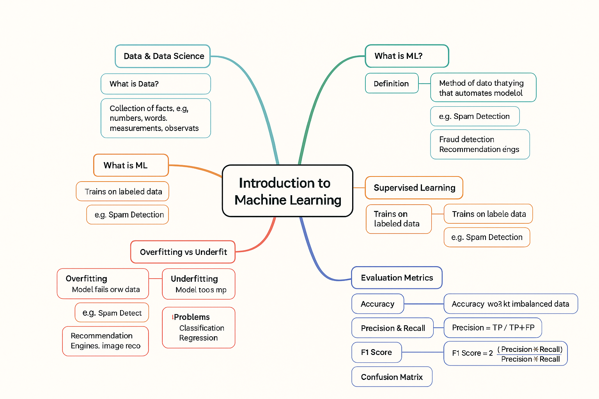

# 📚 Introduction to Machine Learning (ML) — Notes



---

## 1️⃣ What is Data & Data Science?

### ➡️ What is Data?

- **Data** = Collection of facts, such as numbers, words, measurements, observations.

### ➡️ What is Data Science?

- **Data Science** = A multidisciplinary field combining **statistics, computer science, and domain knowledge** to extract insights from data.

### ➡️ Who is a Data Scientist?

> A person better at statistics than any software engineer and better at software engineering than any statistician!

---

## 2️⃣ What is Machine Learning?

### ➡️ Simple Definition:

- **Machine Learning** = A method of data analysis that **automates model building**.
- It allows computers to **learn from data** without explicit programming for every task.

---

### ➡️ Real-World Applications:

- 🎯 **Fraud detection** in banks.
- 🌐 **Web search results** optimization.
- 📈 **Credit scoring** for loans.
- 🛠 **Predicting equipment failure** in factories.
- 🎥 **Recommendation engines** on Netflix, YouTube.
- 🖼 **Image recognition** and 📧 **Email spam filtering**.

---

## 3️⃣ Types of Machine Learning

### ➡️ Main Categories:

| Type                       | Description                           | Example                   |
| -------------------------- | ------------------------------------- | ------------------------- |
| **Supervised Learning**    | Learn from labeled data.              | Spam Email Detection 📧   |
| **Unsupervised Learning**  | Find hidden patterns in data.         | Customer Segmentation 🛒  |
| **Reinforcement Learning** | Learn by trial and error via rewards. | Robot learning to walk 🤖 |

---

## 4️⃣ Supervised Learning 🔍

### ➡️ How It Works:

- Trains using **labeled data** (input + correct output).
- Learns by comparing predictions to correct answers.

**Example:**  
Email → Model → Label: Spam or Not Spam.

---

### ➡️ Two Main Problems:

- **Classification** ➡️ Categorize (e.g., Cat vs Dog 🐱🐶)
- **Regression** ➡️ Predict continuous value (e.g., House Price Prediction 🏡💲)

---

### ➡️ The Data Split Strategy:

- **Training Set** → To train model.
- **Validation Set** → To tune model hyperparameters.
- **Test Set** → Final evaluation of model's performance.

⚡ **Important:** After seeing test set results, **no more model adjustments** allowed!

---

## 5️⃣ Overfitting vs Underfitting 🧠

| Concept          | Meaning                                                              | Visualize          |
| ---------------- | -------------------------------------------------------------------- | ------------------ |
| **Overfitting**  | Model memorizes training data but fails on new data (high variance). | Model learns noise |
| **Underfitting** | Model too simple to capture trends (high bias).                      | Model too dumb     |

**✅ Ideal:** Good balance between bias and variance.

---

## 6️⃣ Evaluation Metrics (for Classification)

### ➡️ 1. Accuracy

**Formula:**  
\[
\textbf{Accuracy} = \frac{\text{Correct Predictions}}{\text{Total Predictions}}
\]

**⚡ Problem:** Useless when classes are **imbalanced**.

🧠 **Example:** 99 dogs 🐶 + 1 cat 🐱 → Predicting all dogs = 99% accuracy but 0% meaningful!

---

### ➡️ 2. Precision and Recall

| Metric        | Definition                            | Formula                                   |
| ------------- | ------------------------------------- | ----------------------------------------- |
| **Precision** | How many selected items are relevant? | \(\text{Precision} = \frac{TP}{TP + FP}\) |
| **Recall**    | How many relevant items are selected? | \(\text{Recall} = \frac{TP}{TP + FN}\)    |

Where:

- TP = True Positive
- FP = False Positive
- FN = False Negative

---

### ➡️ 3. F1-Score

**Definition:**

- Harmonic mean of **precision** and **recall**.

**Formula:**  
\[
\textbf{F1 Score} = 2 \times \frac{Precision \times Recall}{Precision + Recall}
\]

✅ Use when you need a balance between precision and recall.

---

### ➡️ 4. Confusion Matrix

A table showing:
| | Predicted Positive | Predicted Negative |
|----------------|---------------------|---------------------|
| **Actual Positive** | True Positive (TP) | False Negative (FN) |
| **Actual Negative** | False Positive (FP) | True Negative (TN) |

📊 It gives a complete picture of classification results.

---

## 7️⃣ Python Coding Examples 🐍

### ➡️ Train/Test Split Example:

```python
from sklearn.model_selection import train_test_split

# Example data
X = [[0], [1], [2], [3]]
y = [0, 1, 2, 3]

# Split data
X_train, X_test, y_train, y_test = train_test_split(X, y, test_size=0.5)
```

---

### ➡️ Supervised Learning (Classification) Example:

```python
from sklearn import datasets
from sklearn.neighbors import KNeighborsClassifier
from sklearn.metrics import accuracy_score

# Load example data
iris = datasets.load_iris()
X = iris.data
y = iris.target

# Train/Test Split
X_train, X_test, y_train, y_test = train_test_split(X, y, test_size=0.3)

# Train a model
model = KNeighborsClassifier(n_neighbors=3)
model.fit(X_train, y_train)

# Predict
predictions = model.predict(X_test)

# Evaluate
print(f"Accuracy: {accuracy_score(y_test, predictions):.2f}")
```

---

### ➡️ Confusion Matrix, Precision, Recall, F1 Score Example:

```python
from sklearn.metrics import confusion_matrix, precision_score, recall_score, f1_score

# Assume y_test and predictions from above
print(confusion_matrix(y_test, predictions))
print(f"Precision: {precision_score(y_test, predictions, average='macro'):.2f}")
print(f"Recall: {recall_score(y_test, predictions, average='macro'):.2f}")
print(f"F1 Score: {f1_score(y_test, predictions, average='macro'):.2f}")
```

---

## 8️⃣ Practice Questions 🎯

### ➡️ Conceptual

1. **What happens if your model has very high accuracy but your dataset is extremely imbalanced?**

   - ✨ Answer: Accuracy becomes misleading; precision and recall are better indicators.

2. **What is the purpose of a validation set?**
   - ✨ Answer: To tune hyperparameters without touching the test set.

---

### ➡️ Numerical

Given:

- TP = 90, FP = 10, FN = 30

Calculate:

1. **Precision**
   - \[
     Precision = \frac{90}{90+10} = 0.9
     \]
2. **Recall**
   - \[
     Recall = \frac{90}{90+30} = 0.75
     \]
3. **F1 Score**
   - \[
     F1 = 2 \times \frac{0.9 \times 0.75}{0.9 + 0.75} = 0.81
     \]

---

## 9️⃣ Summary & Key Takeaways 📝

- Machine Learning **automates learning** from data.
- Three main types: **Supervised**, **Unsupervised**, **Reinforcement** learning.
- Evaluation matters — **Accuracy** is not always enough; **Precision, Recall, F1** needed too!
- Watch out for **Overfitting** (too complex) and **Underfitting** (too simple).

---

# 🎯 Final Tip:

Always check your model's behavior on **real-world data** — numbers alone never tell the full story!
